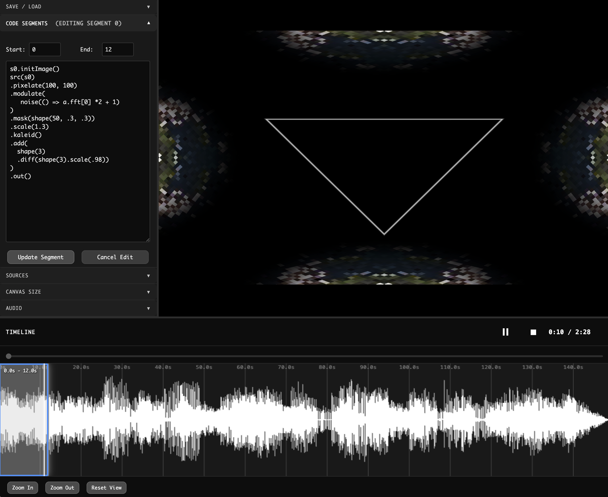

# Hydra Video Editor

A timeline-based video editor where all visuals are generated through Hydra. Instead of editing traditional video clips, you create segments on a timeline, each containing Hydra code that renders generative visuals for specific time ranges. This approach combines the precision of timeline editing with the creative freedom of coding, enabling dynamic, procedurally-generated videos synchronized to audio.

  

The interface has three main areas. The left panel contains controls for managing code segments (set start/end times and write Hydra code), loading media sources (videos/images become `s0`, `s1`, etc.), importing audio files (with FFT data available as `a.fft[0]` for audio-reactive visuals), adjusting canvas resolution, and saving/loading projects. The right panel shows a live preview of your Hydra output, updating in real-time as you edit or play. The bottom panel displays the audio waveform with colored segment blocks overlaid, standard playback controls, a timeline scrubber for navigation, and zoom controls for adjusting timeline detail.

To use the editor, you must load an audio file. Video or image sources are optional. Create segments by setting time ranges and writing Hydra code like `osc(10, 0.1, 1).out(o0)` or `src(s0).kaleid(4).out(o0)`. Press play to watch segments execute at their designated times. Click any segment block on the timeline to edit its code or timing. Projects save as JSON files containing all segment data, source paths, and timeline state. Run locally with `npm start` or any static file server on port 8080. 

Contributions are welcome through issues and pull requests.
